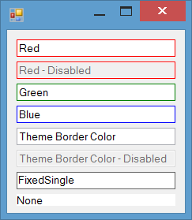

# TextBox Border Color

You can change border color of `TextBox` by overriding [`WndProc`](https://msdn.microsoft.com/en-us/library/system.windows.forms.control.wndproc(v=vs.110).aspx) method and handling [`WM_NCPAINT`](https://msdn.microsoft.com/en-us/library/windows/desktop/dd145212(v=vs.85).aspx) message. This way you can draw on no-client area of the `TextBox` control.

To do so, get the window device context of the control using [`GetWindowDC`](https://msdn.microsoft.com/en-us/library/windows/desktop/dd144947(v=vs.85).aspx). Then to draw, create a `Graphics` object from that context, then draw border for control.

You need to the control when assigning new `BorderColor` or when the size of control changes. To do so, you can use [`RedrawWindow`](https://msdn.microsoft.com/en-us/library/windows/desktop/dd162911(v=vs.85).aspx) method.

`MyTextBox` control has a `BorderColor` property. The control uses `BorderColor` if the property values is different than `Color.Transparent` and `BorderStyle` is its default value `Fixed3d`. To see the themed border color, set the `BorderColor` to `Color.Transparent`.

